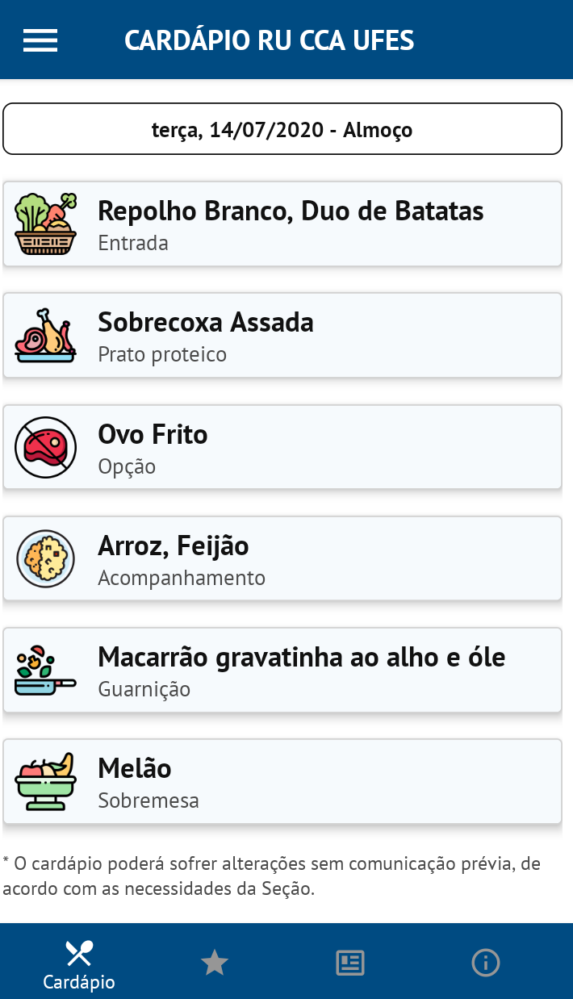
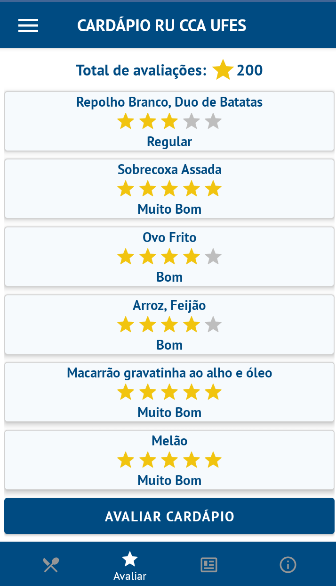
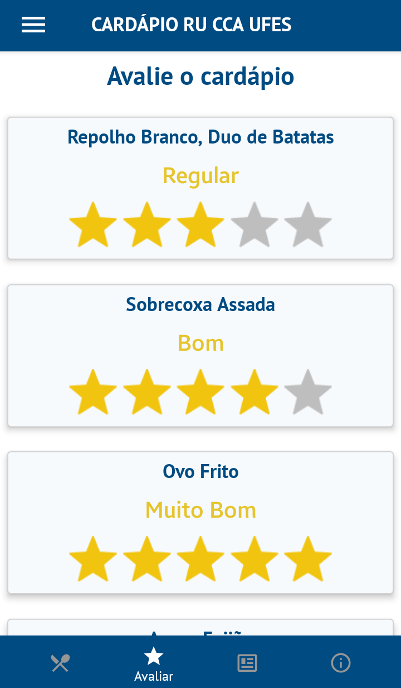
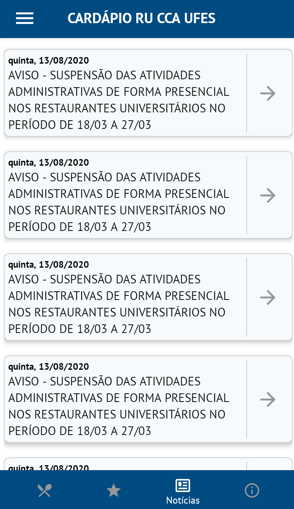
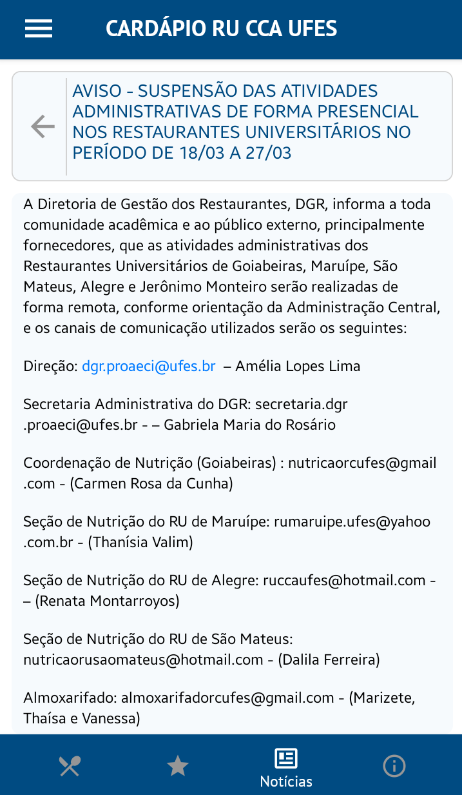
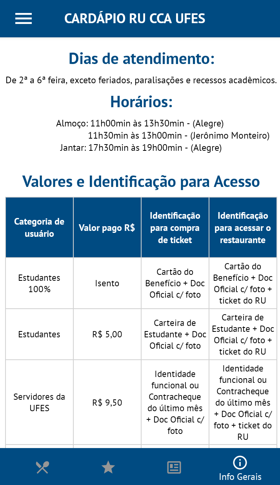
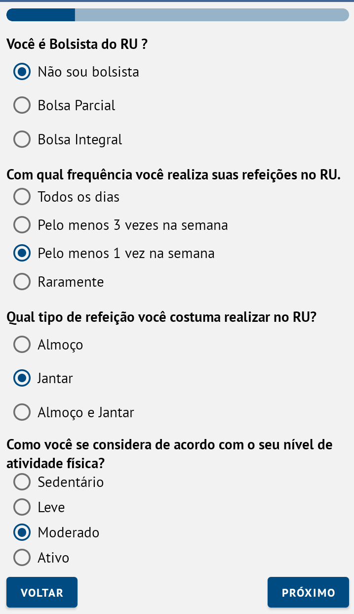

# Aplicação mobile para o restaurante universitário do CCA-UFES
### :construction: TCC em desenvolvimento.

## 📑 Plataformas

O TCC está sendo desenvolvido como um Full Stack App, ou seja, Front-end, Back-end e Mobile, cada uma das partes terá uma função específica, detalhes de cada parte pode ser vista abaixo:

 - Front-end (https://github.com/ottofq/tcc-frontend)
 - Back-end (https://github.com/ottofq/tcc-backend)
 

## Algumas screenshots

  
  
  
  

  
  
  
  

---

 ### 🛠 Feito com
  - [React Native](https://github.com/facebook/react-native)
  - [Styled Components](https://github.com/styled-components/styled-components)
  - [React Native Paper](https://github.com/callstack/react-native-paper)
  - [React Navigation](https://github.com/react-navigation/react-navigation)
  - [React Hook Forms](https://github.com/react-hook-form/react-hook-form)
  - [Lottie React Native](https://github.com/react-native-community/lottie-react-native)
  - [React Native Shimmer](https://github.com/oblador/react-native-shimmer)
  - [React Native Vector Icons](https://github.com/oblador/react-native-vector-icons)
  - [Yup](https://github.com/jquense/yup)
  - etc..
